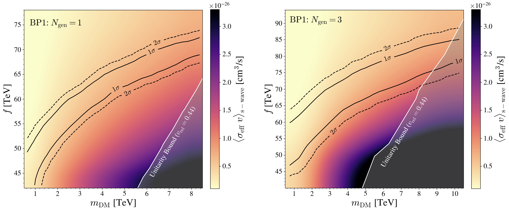

# SU2LDM_public

This repository contains the code used to produce the results and plots in the paper: 

#### "Dark Matter Freeze-out during SU(2)_L Confinement" 

Authors: Jessica N. Howard, Seyda Ipek, Tim M.P. Tait, Jessica Turner

Paper e-print link: https://arxiv.org/abs/2112.09152

Paper DOI: 10.1007/JHEP02(2022)047

# How to cite

If you use this code, please cite the following DOI as well as the above paper:

Code DOI: 10.5281/zenodo.5965537

# Software Environment Setup

1. Make sure you have an anaconda3 installation with conda version 4.10.x (or newer). See https://docs.anaconda.com/anaconda/install/index.html for details on how to install anaconda. To check if you already have this installation, run the following on the command line and you should see similar outputs:
    
    $ which conda
    
    /Users/username/anaconda3/condabin/conda
    
    $ conda --version
    
    conda 4.10.1

2. Create a bare-bones Python 3.6 (e.g. Python 3.6.12) installation, including the (usually pre-installed) pip package manager which we'll use in step 3. There are many ways to do this (e.g., with virtualenv, or venv); we recommend the following setup with conda. Run the following on the command line:

    $ conda create --name py36-su2ldm python=3.6
    
    $ conda activate py36-su2ldm

3. After running conda activate py36-su2ldm, run the following to install the required packages.

    $ pip install -r softwareRequirements/coreRequirements.txt

    The main package dependencies are listed in coreRequirements.txt. In order to avoid possible installation issues we have not listed their specific versions in coreRequirements.txt. However they are as follows:
    
    - ulysses==1.0.1
    - jupyter==1.0.0
    - pandas==1.1.5
    - seaborn==0.11.2
    
    These specific versions are also listed in softwareRequirements/coreRequirements_specificVersions.txt.

# Code Outline

This code calculates the relic abundance of dark matter for the model assumed in the paper. It is set up to interface with the software package ULYSSES which gives an efficient method for scanning the parameter space with a pymultinest backend. For more details on ULYSSES, see https://arxiv.org/abs/2007.09150 and https://github.com/earlyuniverse/ulysses.

Below is a brief outline of the code; more thorough documentation will be added later. 

There are two different cases (see the paper for details):

1) A toy model with only 1 generation of standard model particle content (Ngen=1)

2) The full model with 3 generations of standard model particle content (Ngen=3)

## Brief code descriptions:

#### preScan.py: Creates several data files containing large arrays which are used in the calculation. Run this first.

Produces Data/npyFiles/FhatMatrices_DMBasis_Ngen1.npy in the Ngen=1 case. Produces Data/npyFiles/FhatMatrices_IntBasis_Ngen3.npy and Data/npyFiles/VMatrix_massToDM_Ngen3.npy in the Ngen=3 case. Note that Data/npyFiles/FhatMatrices_IntBasis_Ngen3.npy is too large to be stored directly on the GitHub repository so running preScan.py is required. Instructions for running preScan.py from the command line are in a comment at the top of the file.

#### omegaH2_ulysses.py: This is the main file which is used to interface with ULYSSES for the parameter scan.

This contains the class SU2LDM, with the property "EtaB" which returns the dark matter's omegaH2 value (oh2). The name "EtaB" is just to properly interface with ULYSSES. 

#### omegaH2.py: This is the file which does the heavy lifting in calculating oh2. 

This relies on functions contained in utilityFunctions/. 

#### calcAeffOnGrid.py: This runs omegaH2.py with special flags to pre-calculate the effective cross-section for a pre-selected grid of paramters.

The oh2 calculation code can take a while (several minutes per parameter point for Ngen=3). When making the final paper plots a grid of parameter points is required. This code pre-calculates this grid and stores the results so they can be read-in when plotting as opposed to calculated in the plotting notebooks repeatedly. For more details, see the .ipynb notebooks in Plotting/.

#### exampleNotebooks/calculationExamples_Ngen1and3.ipynb: Demonstrates how to calculate oh2. 

This serves as a check to make sure the workflow is functioning properly before running a scan. It also contains useful information regarding the physical meanings of the scan parameters. See the paper for more details.

# Example of how to run ULYSSES

#### To run ULYSSES on a single test data point, run the following on the command line:

$ uls-calc -m omegaH2_ulysses.py:SU2LDM Data/test.dat

#### To perform a 1D scan (example scans from 4.0 to 5.0 in fpi), run the following on the command line:

$ uls-scan -m omegaH2_ulysses.py:SU2LDM Data/test_1Dscan.dat

#### To perform a multi-dimensional scan (example scans from 4.0 to 5.0 in fpi and -3.0 to -2.0 in bsmall) using multinest as a backend, run the following on the command line:

$ uls-nest -m omegaH2_ulysses.py:SU2LDM Data/test_multiDscan.dat